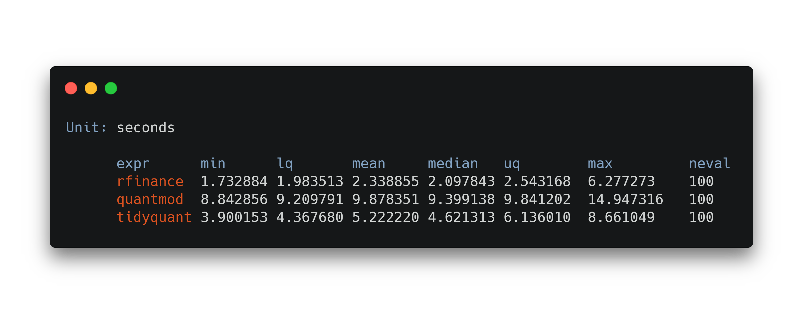

# rfinance 

<!-- badges: start -->
<!-- badges: end -->

The goal of rfinance is to provide a user-friendly suit of tools to perform financial analysis, using R.

## Installation

You can install the released version of rfinance from [CRAN](https://CRAN.R-project.org) with:

``` r
install.packages("rfinance")
```


## Why you should use `rfinance`

`rfinance` aims to provide with a user-friendly API that is robust, fast, efficient and more consistent with common `tidy` R usage.

### Speed

If we want to download data of many different companies, computation times can very easily sky-rocket and get impractiable. One of the main reasons for this is packages making several calls to the API they are getting the data from for _every_ company you are asking. `rfinance` 

```
library(microbenchmark)
symbols <- sample(get_symbols_list(index = "sp500"), 10)
microbenchmark(
  rfinance = rfinance::get_historic_prices(symbols),
  quantmod = quantmod::getSymbols(symbols),
  tidyquant = tidyquant::tq_get(symbols, get = "stock.prices")
)
```



## Examples

### Historic Prices

Let's say that you want to download all historic prices from a given company. `get_historic_prices()` will let you do just that and get it stored in a `data.frame`. You just need to specify the **symbol**. In the case of this example, *Microsoft*'s symbol is `MSFT`.

``` r
library(rfinance)
df <- get_historic_prices(symbol = 'MSFT')
```

### Financial Statements

In most financial analysis, the financial statements released by firms are arguably the more important variables, and the harder to get.

`rfinance` provies a set of functions to get the different financial statements of any public company.

```r

firm <- 'MSFT'

cash_flow     <- get_cash_flow_statement(symbol = firm)
balance_sheet <- get_balance_sheet_statement(symbol = firm)
income        <- get_income_statement(symbol = firm)

```

### Symbols List

At this point it'd be natural to ask yourself what companies are available for this. `rfinance` includes a function to check just that. `get_symbols_list()` will give you an array of all the symbols available in the API.

```r
symbols_list <- get_symbols_list()
```

